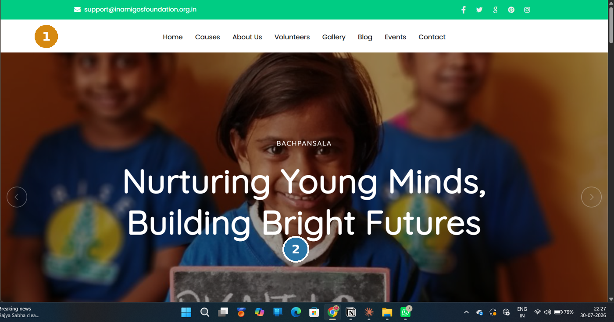
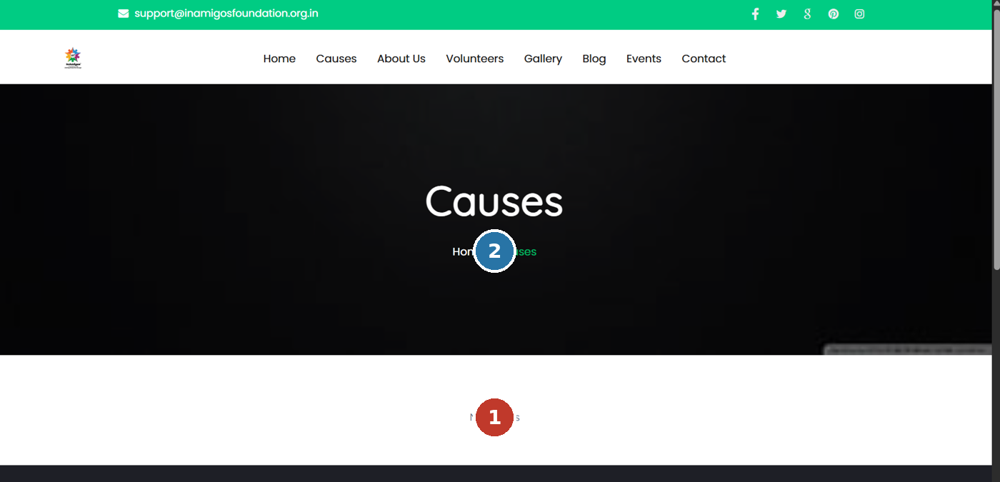
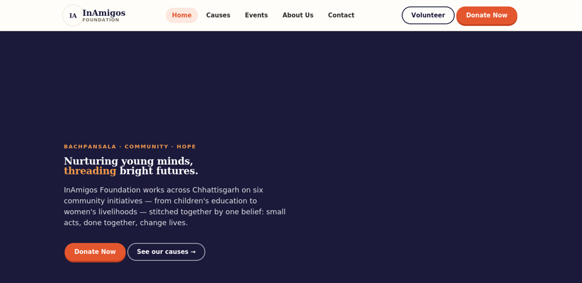

# InAmigos Foundation — Website Redesign (Product & UX Case Study)

A UX audit, prioritized recommendations, and a fully interactive redesign concept for [InAmigos Foundation](https://inamigosfoundation.org.in)'s website, built during my Web Development internship with the organization.

**🔗 Live demo:** _add your GitHub Pages link here after publishing (see below)_
**📊 Full case study deck:** [`docs/InAmigos_CaseStudy_Deck.pptx`](docs/InAmigos_CaseStudy_Deck.pptx)

---

## The problem

An independent heuristic evaluation of the live site surfaced several issues affecting the donation funnel — most critically, the **Causes page rendered with zero content**, meaning the site's single most important conversion step was a dead end.

| Before | |
|---|---|
|  | Small logo, no hero CTA |
|  | Causes page: "No Results" |

Full findings, an impact-vs-effort prioritization matrix, and annotated screenshots are in the case study deck linked above.

## The redesign

This repo contains a working front-end redesign of the Homepage, Causes, Events, About, and Contact pages — built to demonstrate the fixes, not just describe them.



**What's functional:**
- Real client-side navigation across 5 pages (no reloads)
- Populated, filterable Causes page (the core fix)
- Category-filterable Events listing
- A donate flow (modal + amount selection + confirmation state — demo checkout, no real payment)
- Count-up stats, scroll reveals, responsive layout, mobile menu

**Design direction:** a warm indigo / marigold / vermilion palette (moving away from the site's flatter green/black default) with a "running stitch" motif used as a signature visual thread throughout — a nod to the Foundation's women's-empowerment livelihood work.

## Tech

Plain HTML/CSS/JS — no build step, no dependencies. Open `index.html` directly, or serve it with any static host.

## Publishing this yourself

```bash
git init
git add .
git commit -m "InAmigos Foundation website redesign — case study + demo"
git branch -M main
git remote add origin https://github.com/<your-username>/<repo-name>.git
git push -u origin main
```

Then in your repo on GitHub: **Settings → Pages → Source: `main` branch, `/ (root)`** → save. GitHub gives you a live URL at `https://<your-username>.github.io/<repo-name>/` within a minute or two — that's your shareable link.

## Context

Built by [Bhumika Nathawat](https://linkedin.com/in/bhumikanathawat1910) as part of a Product & UX internship — B.Tech CSE, JECRC University.
